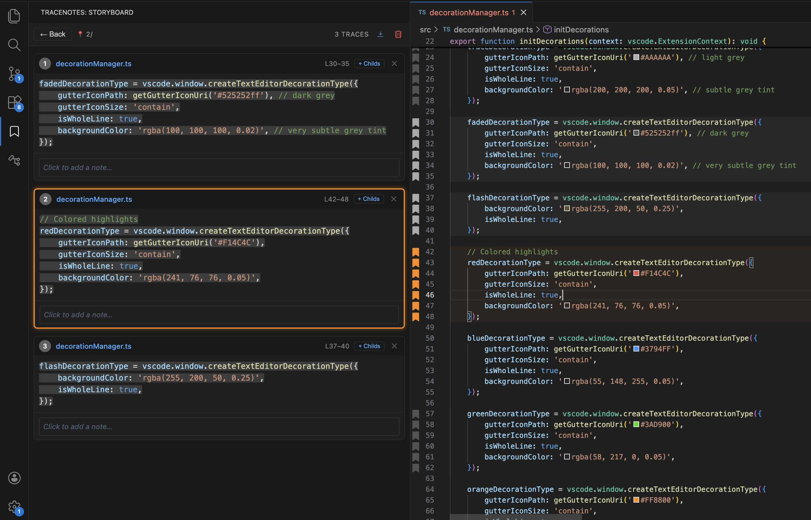
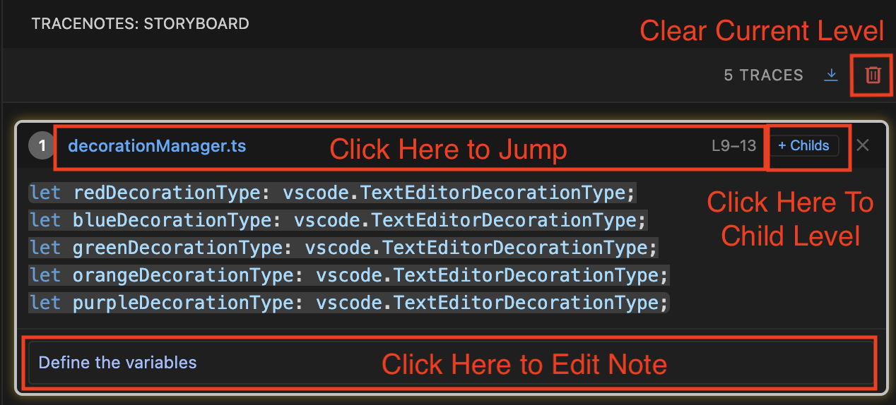

# TraceNotes

> The best VS Code extension for code tracing and note-taking.

### Simply press `Opt+C` or `Alt+C` to collect traces; the rest is intuitive.



## Features

- **Collect Traces** – Select code in any file and capture it as a trace point with smart dedent.
- **Hierarchical Organization** – Group traces into nested levels to organize complex code flows.
- **Color Coded Highlights** – Categorize traces with distinct colors (Red, Blue, Green, Orange, Purple) via right-click context menu.
- **Visual Cues** – Gutter icons and background highlights in the editor indicate traced code.
- **Bi-directional Navigation** – Click a trace card to jump to code; move cursor in editor to scroll to the corresponding trace card.
- **Sidebar Storyboard** – View all traces in a React-powered sidebar with syntax highlighting.
- **Drag & Drop** – Reorder traces to build your narrative.
- **Editable Notes** – Annotate each trace with context or observations.
- **Markdown Export** – Export all traces (including nested groups) as a formatted Markdown document.
- **Crash Recovery** – Traces persist in workspace state across reloads.

## Usage

### Collecting Traces

1. Select any block of code in your editor.
2. Press `Option + C` (macOS) or `Alt + C` (Windows/Linux), or use the command `TraceNotes: Collect Trace`.
3. The code snippet will appear as a new card in the TraceNotes sidebar.



### Hierarchical Organization

TraceNotes supports up to 10 levels of nesting to help you structure your analysis:

- Click the **"+ Childs"** (or **"> N Childs"**) button on any trace card to enter that group.
- New traces collected while in a group will be added as children of that parent trace.
- Use the **Breadcrumbs** at the top or the **"Back"** button to navigate up to parent levels.

### Color Highlighting

- **Right-click** on any trace card to open the color selection menu.
- Choose from **Red**, **Blue**, **Green**, **Orange**, or **Purple** to highlight the trace card and the corresponding code in the editor.
- Select the "None" option to remove the highlight.

### Markdown Export

- Click the **Export** icon (document with arrow) in the sidebar header to generate a Markdown file containing all your traces.
- Nested traces are rendered with appropriate heading levels to preserve the structure.

### Clearing Traces

- Click the **Trash Can** icon in the sidebar header to clear all traces **in the current level**.
- This allows you to reset a specific group without losing the entire trace history.

## Commands

| Command                          | Keybinding (macOS) | Keybinding (Win/Linux) | Description                                    |
| :------------------------------- | :----------------- | :--------------------- | :--------------------------------------------- |
| `TraceNotes: Collect Trace`      | `Option + C`       | `Alt + C`              | Capture the current selection as a trace point |
| `TraceNotes: Export to Markdown` | -                  | -                      | Export all traces to a new Markdown document   |
| `TraceNotes: Clear All Traces`   | -                  | -                      | Remove all collected traces                    |

## Development

### Prerequisites

- Node.js ≥ 18
- VS Code ≥ 1.85

### Setup

```bash
npm install
npm run build
```

### Run in Development

```bash
code --extensionDevelopmentPath=$(pwd)
```

Or press `F5` in VS Code to launch the Extension Development Host.

### Watch Mode

```bash
npm run watch
```

### Build VSIX

To package the extension into a `.vsix` file for installation:

```bash
npx @vscode/vsce package
```

## Project Structure

```
src/
├── extension.ts        # Entry point, commands, message routing
├── types.ts            # TracePoint interface & message types
├── traceManager.ts     # State manager with persistence
├── collector.ts        # Code selection + smart dedent
├── decoration.ts       # Editor decorations (gutter icons, highlights)
├── exporter.ts         # Markdown generator
├── webviewProvider.ts  # Sidebar webview provider
└── webview/
    ├── index.tsx               # React entry + styles
    ├── components/
    │   ├── Storyboard.tsx      # Main wrapper, search, breadcrumbs
    │   └── TraceCard.tsx       # Individual trace card with context menu
    └── utils/
        └── messaging.ts        # Extension ↔ Webview helpers
```

## License

MIT
